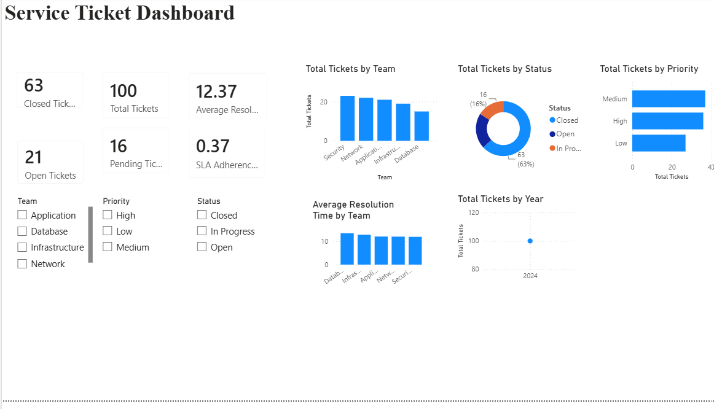

# Service Ticket Dashboard

## Dashboard Preview

---

## 📌 Project Overview

This project presents an interactive Power BI dashboard to monitor service desk operations. It helps track ticket volumes, SLA adherence, resolution times, pending tickets, and team performance.

---

## 🎯 Business Problem

Support teams need real-time visibility into ticket status and SLA compliance to improve service quality and reduce resolution time. This dashboard provides actionable insights for operational decision-making.

---

## 🛠️ Tools & Technologies

- Power BI
- Microsoft Excel
- DAX
- Data Visualization

---

## 📊 Dashboard Features

- Total Tickets
- Open vs Closed Tickets
- SLA Adherence
- Average Resolution Time
- Pending Tickets
- Team Performance
- Interactive Filters

---

## 📂 Dataset

The dataset contains:

- Ticket ID
- Priority
- Status
- Assigned Team
- Resolution Time
- SLA Status
- Created Date
- Closed Date

---

## 💡 Key Insights

- Monitored SLA compliance across teams.
- Identified ticket backlogs.
- Measured average resolution time.
- Compared team performance.
- Improved operational visibility.

---

## 📁 Files Included

- Service_Ticket_Dashboard.pbix
- Service_Ticket_Data.xlsx
- Project_Report.pdf

---

## 👩‍💻 Author

**Sushma Rakesh**

Power BI | SQL | Python | Business Analytics | GenAI
